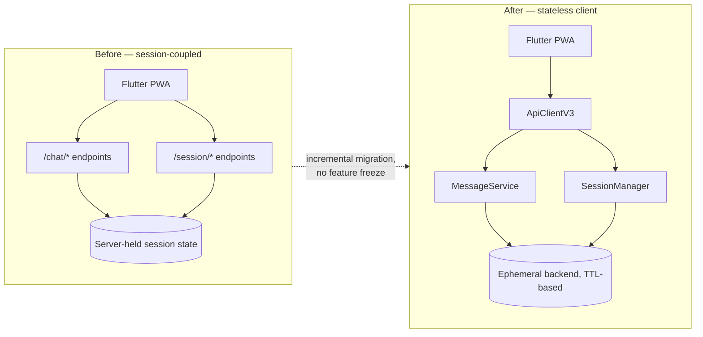

# Zymsia Mobile — Migrating a Shipped App's Backend Without a Rewrite-and-Pray

A Flutter web app, delivered as a Progressive Web App (PWA) for mobile browsers, that shipped and then had its entire backend contract replaced underneath it — session-based chat endpoints swapped for a stateless, privacy-first API — without a big-bang rewrite.

This repo is a sanitized case-study extract of the migration: the before/after architecture and the debt-reduction process, not the production source.

**Role:** Program Manager: product definition, architecture decisions, program governance and QA, with Claude Code as the execution team ([Idea to Launch method](https://github.com/eugeniozamora/idea-to-launch)).

## The problem

The original mobile client talked to a `/chat/*` + `/session/*` backend: server-held conversation sessions, client trusting server-side state to "remember" context. That backend was being replaced by a new stateless, ephemeral architecture (see the companion [ai-nutrition-coach](https://github.com/eugeniozamora/case-study-ai-nutrition-coach) case study) for privacy reasons — data retention had to move from "the server remembers" to "nothing is retained past a short session window."

The app was run as if it had live users: no feature freeze while that happened. The migration had to happen incrementally, behind a new client-side API layer, while the old code was identified, proven unused, and removed — not just left to rot alongside the new path.

## Before / after

**Key decision — introduce the new client layer before deleting the old one.** `ApiClientV3` and `MessageService` were built and shipped alongside the legacy `/chat` and `/session` calls, not as a replacement PR. Once the new path was live and verified in the deployed environment, the legacy inventory was audited endpoint-by-endpoint before removal — so "is this actually unused?" was answered with evidence, not assumption.

## Migration results

- **~400 lines of legacy code removed** (old `SessionService`, direct `/chat` + `/session` calls) once confirmed unreferenced
- **75+ tests passing** through the transition — the safety net that made incremental removal possible instead of a freeze-and-rewrite
- Legacy inventory tracked explicitly in a living document, not tribal knowledge — every removed endpoint had a written reason

## Tech stack

| Layer | Choice | Why |
|---|---|---|
| Client | Flutter Web / Dart, installable PWA | runs in the mobile browser, no app-store release |
| Backend integration | Firebase Auth, REST | replaced session-coupled calls with a stateless client abstraction |
| Testing | Flutter test suite (75+ tests) | migration safety net |

## Why this matters as a case study

Most portfolios show a system built once. This shows the harder, more common reality of real engineering work: a shipped product whose foundation had to change under it, done with a paper trail (debt inventory, test coverage, incremental cutover) instead of a rewrite.

## What's in this repo vs. what's not

This extract includes the before/after architecture and the migration process/metrics. It omits the production `lib/` source tree, patient data, and legal/compliance docs — those stay in the private repo.

Happy to walk through the migration in more depth on a technical call.

**[Book a meeting](https://calendar.app.google/5FeUeC4X1VBYt2bU6)** · [eugeniozamora.com](https://eugeniozamora.com) · [LinkedIn](https://www.linkedin.com/in/eugeniozamora/) · [GitHub](https://github.com/eugeniozamora)
